# VocabApp Backend Flow, Use Cases, and Sequence Diagrams

Tài liệu này mô tả luồng backend thực tế của project VocabApp dựa trên code hiện tại trong `server.js`, `src/app.js`, `src/routes`, `src/controllers`, `src/models`, và `src/services`.

## 1. Tổng Quan Kiến Trúc

### 1.1 Luồng khởi động

1. `server.js` nạp biến môi trường bằng `dotenv`.
2. `src/app.js` tạo Express app.
3. CORS được bật cho tất cả origin.
4. Kết nối MongoDB thông qua `src/config/db.js`.
5. Express JSON parser được kích hoạt.
6. Các route được mount tại:
   - `/api/levels`
   - `/api/lektions`
   - `/api/vocabulary`
   - `/api/ai`
7. Server lắng nghe theo `PORT` hoặc mặc định `3000`.

Lưu ý: file `test-ai.js` đang gọi `http://localhost:3001`, nên nếu dùng script này để test trực tiếp thì cần chạy server ở `3001` hoặc sửa lại URL trong script.

### 1.2 Thành phần chính

- `Level` model: lưu cấp độ học tập.
- `Lektion` model: lưu bài học, liên kết sang `Level` bằng `level_id`.
- `Vocabulary` model: lưu từ vựng, liên kết sang `Lektion` bằng `lektionId`.
- `aiController`: gọi OpenAI để đánh giá và sinh nội dung học tập.
- `test-db` và `api/ai/test`: route kiểm tra nhanh tình trạng hệ thống.

### 1.3 Quan hệ dữ liệu

- Một `Level` có nhiều `Lektion`.
- Một `Lektion` có nhiều `Vocabulary`.
- `Vocabulary` dùng `lektionId` để populate thông tin bài học.
- `Lektion` dùng `level_id` để populate thông tin cấp độ.

## 2. Danh Sách Use Case Theo Code

### 2.1 Nhóm hệ thống

- UC-00: Khởi động server và kết nối MongoDB.
- UC-01: Kiểm tra kết nối database qua `/test-db`.
- UC-02: Kiểm tra route AI đang hoạt động qua `/api/ai/test`.

### 2.2 Nhóm Level

- UC-10: Lấy danh sách tất cả level.
- UC-11: Lấy level theo `id`.
- UC-12: Lấy level theo `name`.

### 2.3 Nhóm Lektion

- UC-20: Lấy danh sách tất cả lektion.
- UC-21: Lấy lektion theo `id`.
- UC-22: Lấy lektion theo `levelId`.

### 2.4 Nhóm Vocabulary

- UC-30: Lấy danh sách tất cả vocabulary.
- UC-31: Lấy vocabulary theo `id`.
- UC-32: Lấy vocabulary theo `lektionId`.
- UC-33: Tìm kiếm vocabulary theo từ khóa `q`.
- UC-34: Lọc vocabulary theo `type`.

### 2.5 Nhóm AI

- UC-40: Đánh giá câu trả lời học sinh với từ vựng đã học.
- UC-41: Kiểm tra ngữ pháp câu tiếng Đức.
- UC-42: Sinh câu hỏi luyện tập từ vựng.
- UC-43: Phân tích lỗi thường gặp từ nhiều câu trả lời.

## 3. API Mapping Theo Route

### 3.1 System routes

- `GET /` -> trả về thông điệp chào mừng.
- `GET /test-db` -> kiểm tra kết nối MongoDB và danh sách collections.
- `GET /api/ai/test` -> kiểm tra route AI.

### 3.2 Levels

- `GET /api/levels`
- `GET /api/levels/:id`
- `GET /api/levels/name/:name`

### 3.3 Lektions

- `GET /api/lektions`
- `GET /api/lektions/:id`
- `GET /api/lektions/level/:levelId`

### 3.4 Vocabulary

- `GET /api/vocabulary`
- `GET /api/vocabulary/search?q=...`
- `GET /api/vocabulary/type/:type`
- `GET /api/vocabulary/:id`
- `GET /api/vocabulary/lektion/:lektionId`

### 3.5 AI

- `POST /api/ai/evaluate-sentence`
- `POST /api/ai/check-german-sentence`
- `POST /api/ai/generate-question`
- `POST /api/ai/analyze-errors`

## 4. Use Case Chi Tiết Và Sequence Diagram

### UC-00: Khởi động server và kết nối MongoDB

**Mục tiêu:** Server khởi động, đọc env, kết nối DB, sau đó sẵn sàng nhận request.

**Luồng chính:**
1. `server.js` load `dotenv`.
2. `src/app.js` được import.
3. `connectDB()` chạy trong `src/app.js`.
4. Mongoose kết nối MongoDB bằng `MONGO_URI` hoặc mặc định `mongodb://127.0.0.1:27017/vocabapp`.
5. Server listen cổng `PORT`.

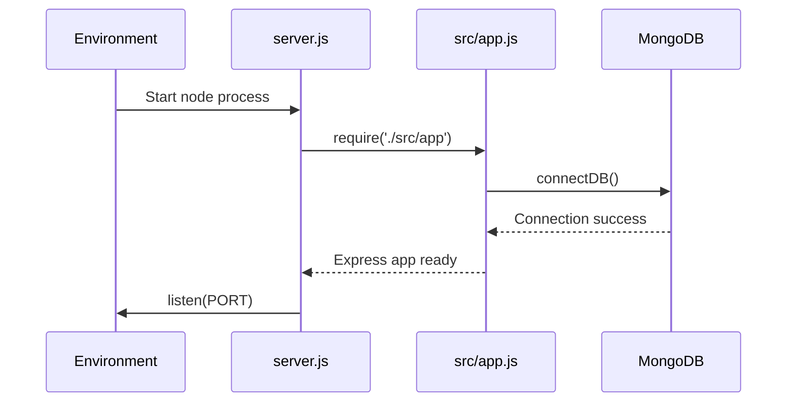

---

### UC-01: Kiểm tra kết nối database `/test-db`

**Mục tiêu:** Xác nhận MongoDB đang hoạt động và liệt kê collections.

**Input:** Không có body.

**Output thành công:**
```json
{
  "status": "Connected",
  "collections": ["levels", "lektions", "vocabularies"]
}
```

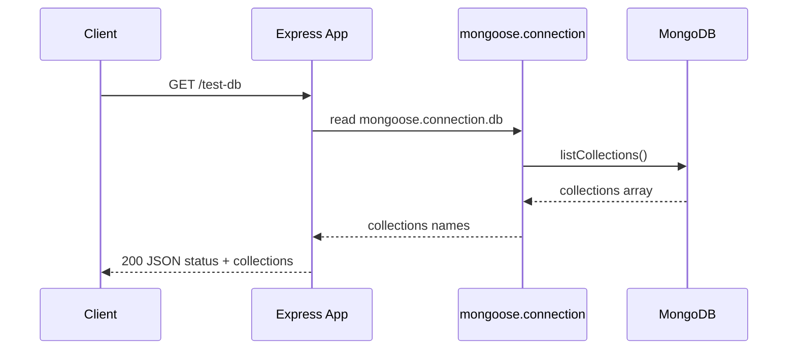

---

### UC-02: Kiểm tra route AI `/api/ai/test`

**Mục tiêu:** Test nhanh xem route AI đã được mount đúng.

**Output:** message + timestamp.

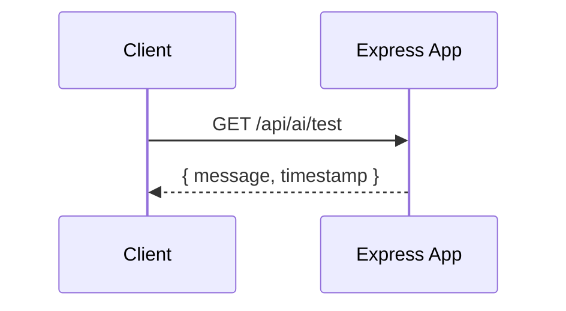

---

### UC-10: Lấy danh sách tất cả Level

**Route:** `GET /api/levels`

**Controller:** `getAllLevels`

**Model:** `Level.find().sort({ order: 1 })`

**Output:**
```json
{
  "success": true,
  "count": 3,
  "data": [
    {
      "_id": "...",
      "level_name": "Beginner",
      "description": "...",
      "order": 1
    }
  ]
}
```

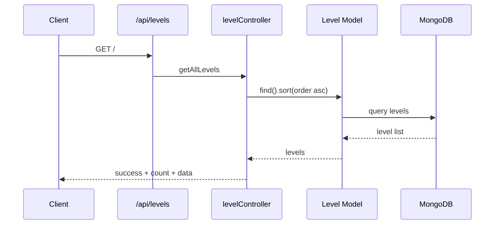

---

### UC-11: Lấy Level theo `id`

**Route:** `GET /api/levels/:id`

**Mục tiêu:** Trả về 1 level cụ thể.

**Nếu không tìm thấy:** `404 Level not found`

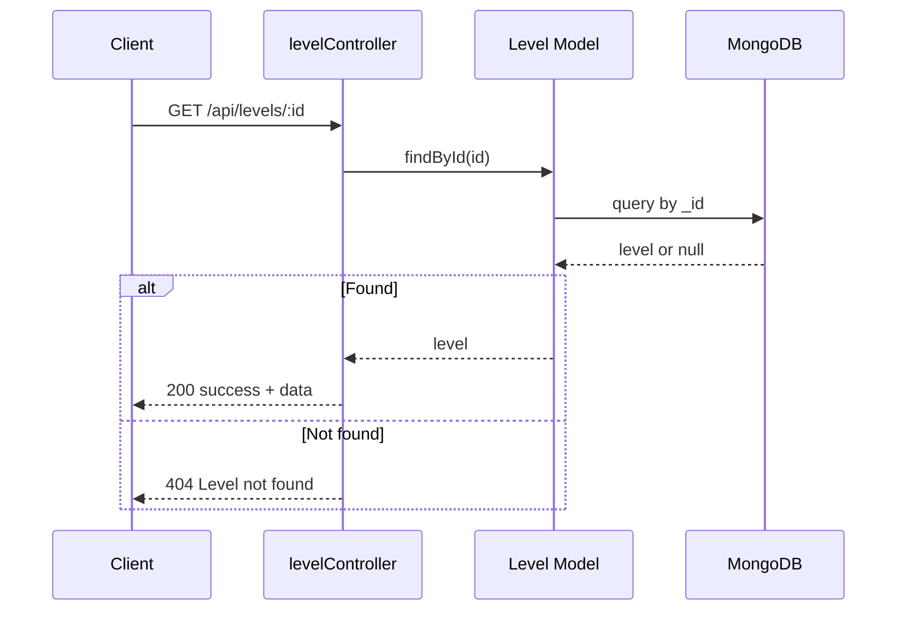

---

### UC-12: Lấy Level theo `name`

**Route:** `GET /api/levels/name/:name`

**Mục tiêu:** Tìm level bằng `level_name` exact match.

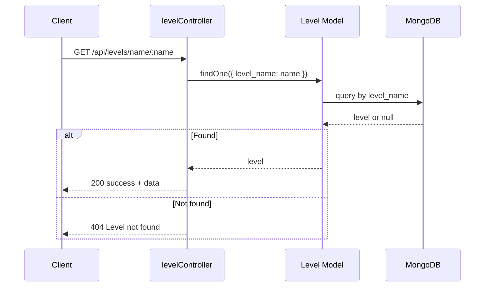

---

### UC-20: Lấy danh sách tất cả Lektion

**Route:** `GET /api/lektions`

**Controller:** `getAllLektions`

**Đặc điểm:** populate `level_id` với `level_name`, rồi sort `order` tăng dần.

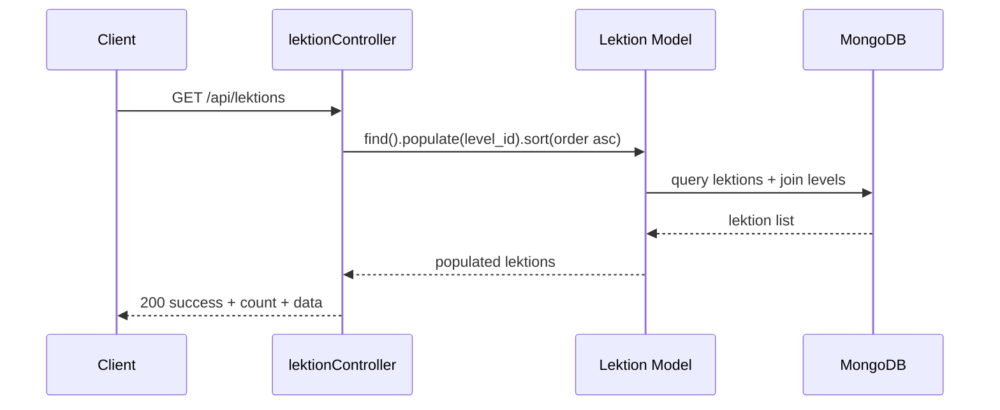

---+

### UC-21: Lấy Lektion theo `id`

**Route:** `GET /api/lektions/:id`

**Mục tiêu:** Trả về 1 lektion và thông tin level đã populate.

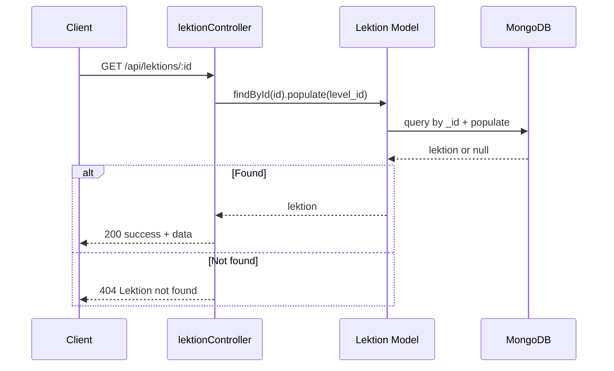

---+

### UC-22: Lấy Lektion theo `levelId`

**Route:** `GET /api/lektions/level/:levelId`

**Mục tiêu:** Lấy toàn bộ bài học của một level.

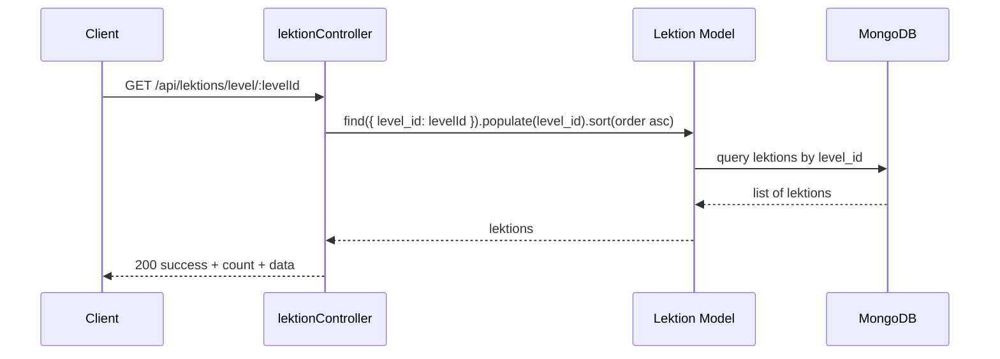

---+

### UC-30: Lấy danh sách tất cả Vocabulary

**Route:** `GET /api/vocabulary`

**Đặc điểm:** populate `lektionId` với `lekttion_name`, sort `createdAt` giảm dần.

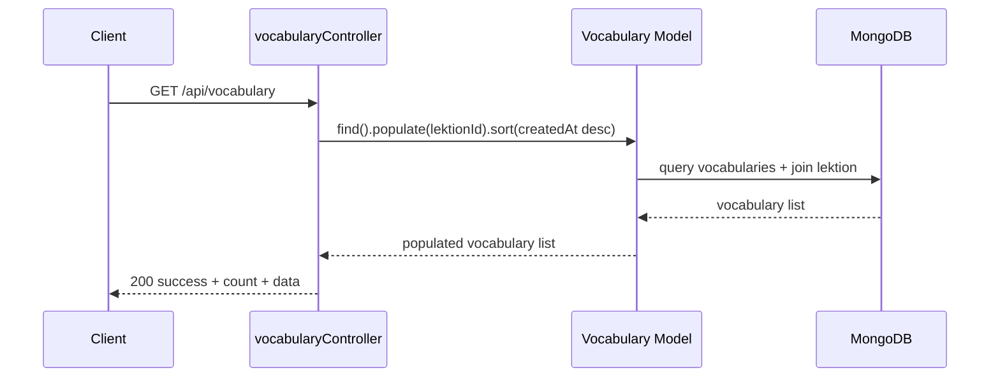

---+

### UC-31: Lấy Vocabulary theo `id`

**Route:** `GET /api/vocabulary/:id`

**Nếu không tìm thấy:** `404 Vocabulary not found`

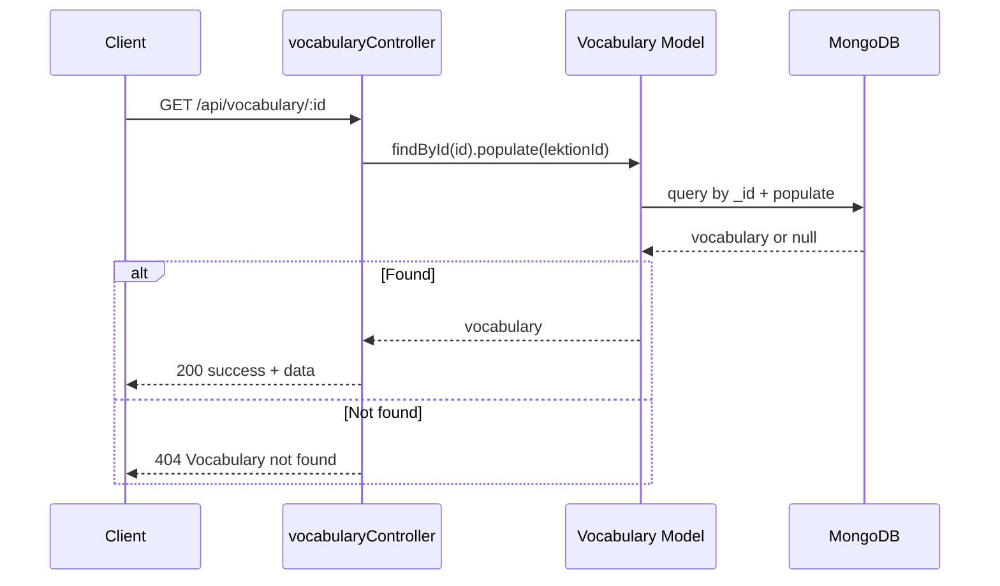

---+

### UC-32: Lấy Vocabulary theo `lektionId`

**Route:** `GET /api/vocabulary/lektion/:lektionId`

**Mục tiêu:** Lấy toàn bộ từ vựng thuộc một bài học.

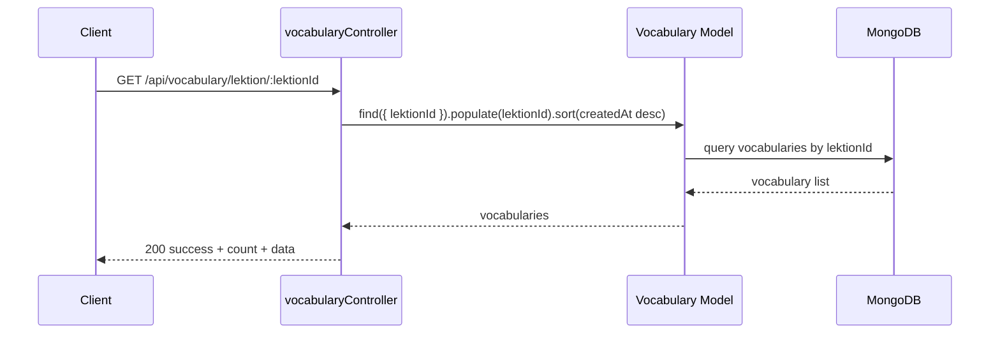

---+

### UC-33: Tìm kiếm Vocabulary theo từ khóa

**Route:** `GET /api/vocabulary/search?q=hello`

**Cách hoạt động:** tìm trong cả `word` và `meaning` bằng regex không phân biệt hoa thường.

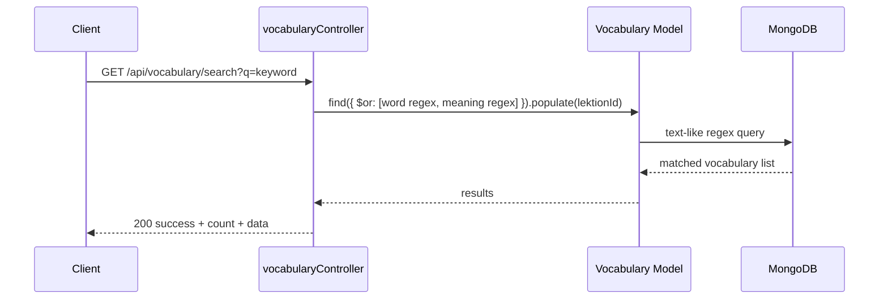

---+

### UC-34: Lọc Vocabulary theo `type`

**Route:** `GET /api/vocabulary/type/:type`

**Giá trị type hợp lệ theo schema:** `noun`, `verb`, `adjective`, `adverb`, `other`.

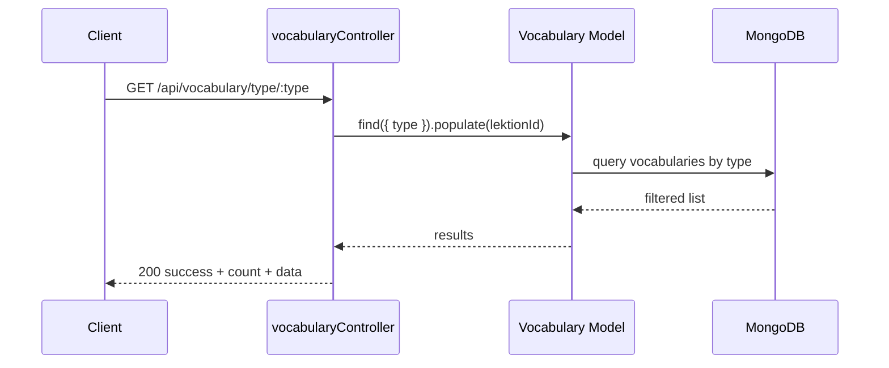

---

### UC-40: Đánh giá câu trả lời học sinh bằng AI

**Route:** `POST /api/ai/evaluate-sentence`

**Body tối thiểu:**
```json
{
  "sentence": "I am happy today",
  "vocabulary": {
    "word": "happy",
    "meaning": "vui vẻ",
    "type": "adjective"
  }
}
```

**Validation trong code:**
- Bắt buộc có `sentence`.
- Bắt buộc có `vocabulary`.

**Luồng xử lý:**
1. Controller build prompt tiếng Việt.
2. Gửi prompt sang OpenAI `gpt-3.5-turbo`.
3. Lấy nội dung trả về.
4. Thử `JSON.parse`.
5. Nếu parse lỗi, dùng fallback mặc định.
6. Trả response chứa `evaluation` và `timestamp`.

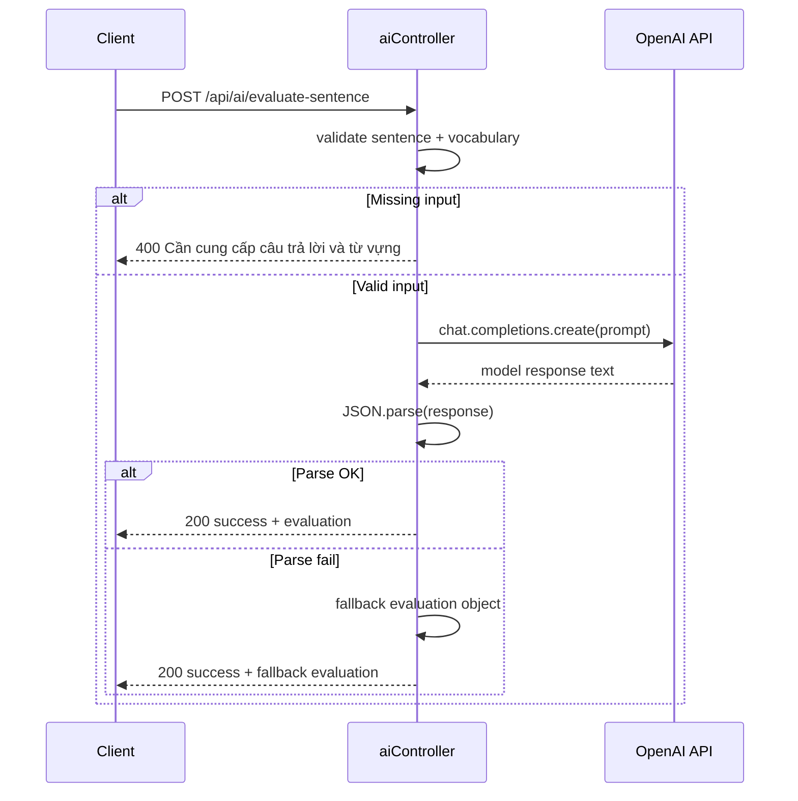

---

### UC-41: Kiểm tra câu tiếng Đức

**Route:** `POST /api/ai/check-german-sentence`

**Body tối thiểu:**
```json
{ "sentence": "Ich habe ein groß Haus" }
```

**Validation trong code:**
- Bắt buộc có `sentence`.

**Đặc điểm:**
- Prompt yêu cầu JSON only.
- Dùng `temperature: 0` để ổn định output.
- Nếu parse lỗi, trả fallback `{ correct: false, corrected: sentence, errors: ["Unable to parse response"] }`.

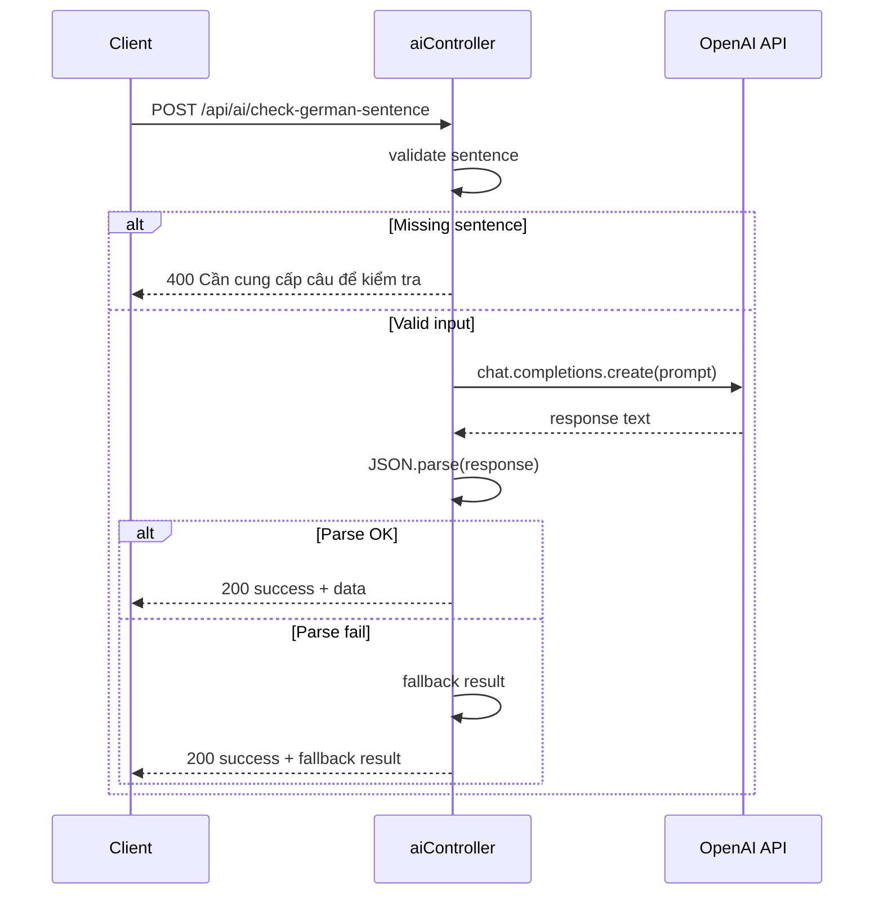

---+

### UC-42: Sinh câu hỏi luyện tập cho Vocabulary

**Route:** `POST /api/ai/generate-question`

**Body tối thiểu:**
```json
{
  "vocabulary": {
    "word": "run",
    "meaning": "chạy",
    "type": "verb"
  },
  "level": "beginner"
}
```

**Validation trong code:**
- Bắt buộc có `vocabulary`.

**Đặc điểm:**
- Nếu OpenAI trả không phải JSON, fallback thành câu hỏi mẫu dựa trên `vocabulary.word`.

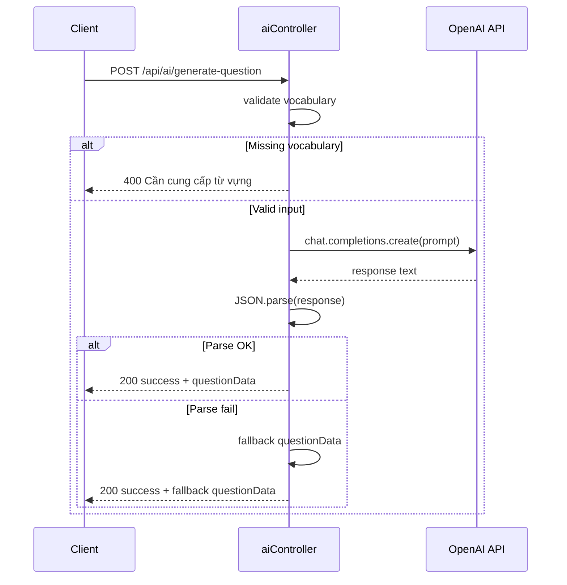

---+

### UC-43: Phân tích lỗi thường gặp từ nhiều câu trả lời

**Route:** `POST /api/ai/analyze-errors`

**Body tối thiểu:**
```json
{
  "sentences": ["I run to school", "She run fast"],
  "vocabulary": {
    "word": "run",
    "meaning": "chạy",
    "type": "verb"
  }
}
```

**Validation trong code:**
- `sentences` phải là array.
- `sentences.length > 0`.

**Đặc điểm:**
- Prompt tổng hợp nhiều câu.
- Nếu parse lỗi, trả fallback phân tích mẫu.

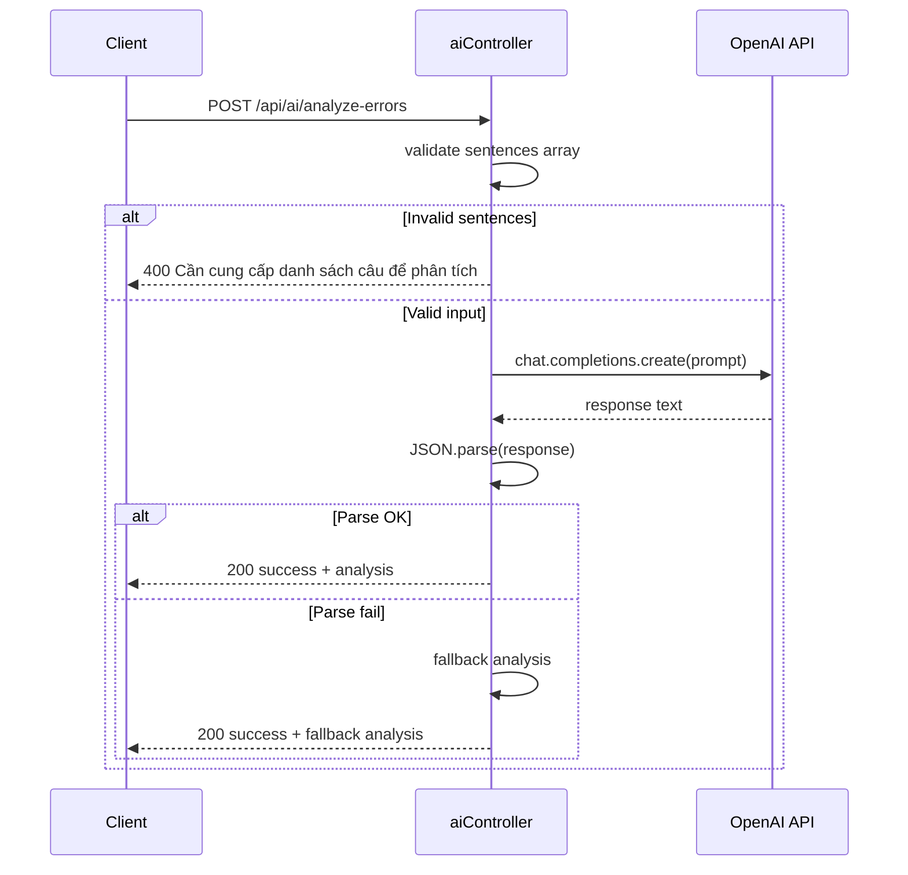

## 5. Response Format Thực Tế

### 5.1 Success response từ CRUD/read API

```json
{
  "success": true,
  "count": 10,
  "data": []
}
```

### 5.2 Success response từ AI API

```json
{
  "success": true,
  "data": {
    "evaluation": {},
    "timestamp": "2026-05-30T00:00:00.000Z"
  }
}
```

### 5.3 Error response chung

```json
{
  "success": false,
  "error": "Error message"
}
```

### 5.4 Status code đang dùng trong code

- `200` khi request thành công.
- `400` khi thiếu input bắt buộc ở API AI.
- `404` khi không tìm thấy `Level`, `Lektion`, hoặc `Vocabulary` theo `id`.
- `500` khi lỗi DB hoặc OpenAI.

## 6. Ghi Chú Quan Trọng Theo Code

- Route `GET /api/levels/name/:name` đang được khai báo sau `/:id`, nhưng do cấu trúc path khác segment nên vẫn hoạt động theo đúng ý định.
- Route `GET /api/vocabulary/search` được khai báo trước `/:id`, tránh bị hiểu nhầm là ID.
- `Vocabulary.example` là kiểu `Mixed`, có thể là string, object, hoặc `null`.
- Trong model `Lektion`, trường là `lekttion_name` theo đúng spelling hiện tại trong code.
- API AI dùng OpenAI trực tiếp từ backend, nên cần `OPENAI_API_KEY` trong `.env`.
- Khi OpenAI trả về nội dung không parse được JSON, controller có fallback để không làm hỏng request.

## 7. Gợi Ý Cách Dùng Tài Liệu Này

- Dùng phần sequence diagram để vẽ lại luồng trong Figma, draw.io, hoặc Mermaid live editor.
- Dùng phần use case làm basis cho test case và API contract.
- Khi thay đổi route hoặc controller, cập nhật file này trước để giữ đồng bộ với backend.
