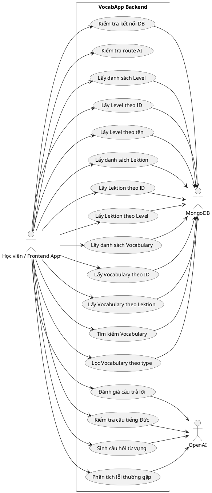
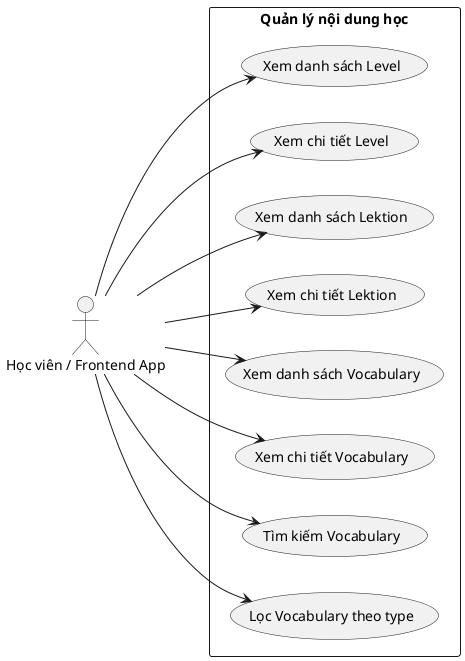
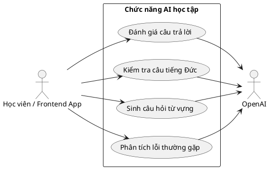
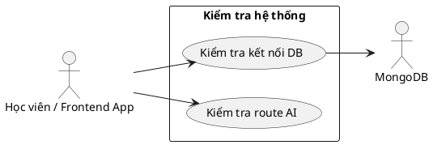

# VocabApp Use Case Model

## 2.2 Tổng quan chức năng

Hệ thống VocabApp hiện tại cung cấp các nhóm chức năng chính cho học viên qua backend REST API:

- Tra cứu và học theo `Level`.
- Xem các `Lektion` thuộc từng level.
- Tra cứu `Vocabulary` theo bài học, theo loại từ, hoặc tìm kiếm theo từ khóa.
- Sử dụng các chức năng AI để đánh giá câu trả lời, kiểm tra ngữ pháp, sinh câu hỏi và phân tích lỗi.
- Kiểm tra trạng thái hệ thống và kết nối cơ sở dữ liệu.

Trong code hiện tại chưa có module đăng nhập hay phân quyền, nên tác nhân chính nên mô tả là `Học viên / Frontend App`. `MongoDB` và `OpenAI` là các hệ thống ngoài hỗ trợ cho nghiệp vụ.

### 2.2.1 Biểu đồ use case tổng quát

Biểu đồ dưới đây đã được viết theo đúng các chức năng thực tế trong project, để bạn có thể copy sang công cụ hỗ trợ PlantUML và xuất hình như mẫu bạn gửi.

### 2.2.2 Mô tả tổng quát luồng nghiệp vụ

- Người dùng mở ứng dụng frontend.
- Frontend gọi các API để lấy `Level`, `Lektion`, `Vocabulary` từ MongoDB.
- Khi học sinh làm bài, frontend gửi dữ liệu câu trả lời sang nhóm API AI.
- Backend xử lý, gọi OpenAI, sau đó trả lại kết quả để hiển thị cho người dùng.

### 2.2.3 Biểu đồ use case phân rã theo module

#### Phân rã 1: Quản lý nội dung học

#### Phân rã 2: Quản lý chức năng AI học tập

#### Phân rã 3: Kiểm tra hệ thống

## 2.3 Đặc tả chức năng

### 2.3.1 Đặc tả use case Kiểm tra kết nối DB

| Mã usecase | UC01 |
|---|---|
| Tên usecase | Kiểm tra kết nối DB |
| Tác nhân | Học viên / Frontend App |
| Tiền điều kiện | Server đang chạy và MongoDB khả dụng |
| Hậu điều kiện | Hệ thống trả về trạng thái kết nối và danh sách collections |

**Luồng sự kiện chính (thành công)**

| STT | Thực hiện bởi | Hành động |
|---|---|---|
| 1 | Học viên / Frontend App | Gửi yêu cầu `GET /test-db` |
| 2 | Hệ thống | Đọc kết nối MongoDB hiện tại |
| 3 | Hệ thống | Lấy danh sách collections trong database |
| 4 | Hệ thống | Trả về kết quả `Connected` kèm danh sách collections |

**Luồng ngoại lệ**

| STT | Thực hiện bởi | Hành động |
|---|---|---|
| 1 | Hệ thống | Không kết nối được MongoDB |
| 2 | Hệ thống | Trả về lỗi `500` với thông tin lỗi |

### 2.3.2 Đặc tả use case Lấy danh sách Level

| Mã usecase | UC10 |
|---|---|
| Tên usecase | Lấy danh sách Level |
| Tác nhân | Học viên / Frontend App |
| Tiền điều kiện | Dữ liệu Level đã tồn tại trong MongoDB |
| Hậu điều kiện | Trả danh sách level để frontend hiển thị |

| STT | Thực hiện bởi | Hành động |
|---|---|---|
| 1 | Học viên / Frontend App | Gửi yêu cầu `GET /api/levels` |
| 2 | Hệ thống | Gọi `Level.find().sort({ order: 1 })` |
| 3 | Hệ thống | Trả danh sách level theo thứ tự tăng dần |

### 2.3.3 Đặc tả use case Lấy Level theo ID

| Mã usecase | UC11 |
|---|---|
| Tên usecase | Lấy Level theo ID |
| Tác nhân | Học viên / Frontend App |
| Tiền điều kiện | Có `id` hợp lệ của level |
| Hậu điều kiện | Trả chi tiết level hoặc báo không tìm thấy |

| STT | Thực hiện bởi | Hành động |
|---|---|---|
| 1 | Học viên / Frontend App | Gửi yêu cầu `GET /api/levels/:id` |
| 2 | Hệ thống | Tìm level bằng `findById` |
| 3 | Hệ thống | Nếu tồn tại thì trả `200` với dữ liệu |
| 4 | Hệ thống | Nếu không tồn tại thì trả `404 Level not found` |

### 2.3.4 Đặc tả use case Lấy Level theo tên

| Mã usecase | UC12 |
|---|---|
| Tên usecase | Lấy Level theo tên |
| Tác nhân | Học viên / Frontend App |
| Tiền điều kiện | Có tên level cần tra cứu |
| Hậu điều kiện | Trả level tương ứng hoặc `404` |

| STT | Thực hiện bởi | Hành động |
|---|---|---|
| 1 | Học viên / Frontend App | Gửi yêu cầu `GET /api/levels/name/:name` |
| 2 | Hệ thống | Tìm bằng `findOne({ level_name: name })` |
| 3 | Hệ thống | Trả kết quả nếu tìm thấy |
| 4 | Hệ thống | Trả `404 Level not found` nếu không tìm thấy |

### 2.3.5 Đặc tả use case Lấy danh sách Lektion

| Mã usecase | UC20 |
|---|---|
| Tên usecase | Lấy danh sách Lektion |
| Tác nhân | Học viên / Frontend App |
| Tiền điều kiện | Dữ liệu Lektion đã có trong DB |
| Hậu điều kiện | Trả danh sách lektion đã ghép level |

| STT | Thực hiện bởi | Hành động |
|---|---|---|
| 1 | Học viên / Frontend App | Gửi yêu cầu `GET /api/lektions` |
| 2 | Hệ thống | Gọi `Lektion.find().populate('level_id', 'level_name').sort({ order: 1 })` |
| 3 | Hệ thống | Trả danh sách lektion |

### 2.3.6 Đặc tả use case Lấy Lektion theo ID

| Mã usecase | UC21 |
|---|---|
| Tên usecase | Lấy Lektion theo ID |
| Tác nhân | Học viên / Frontend App |
| Tiền điều kiện | Có `id` hợp lệ của lektion |
| Hậu điều kiện | Trả chi tiết lektion hoặc `404` |

| STT | Thực hiện bởi | Hành động |
|---|---|---|
| 1 | Học viên / Frontend App | Gửi yêu cầu `GET /api/lektions/:id` |
| 2 | Hệ thống | Tìm lektion bằng `findById` |
| 3 | Hệ thống | Populate `level_id` để lấy tên level |
| 4 | Hệ thống | Trả `200` nếu tìm thấy |
| 5 | Hệ thống | Trả `404 Lektion not found` nếu không có dữ liệu |

### 2.3.7 Đặc tả use case Lấy Lektion theo Level

| Mã usecase | UC22 |
|---|---|
| Tên usecase | Lấy Lektion theo Level |
| Tác nhân | Học viên / Frontend App |
| Tiền điều kiện | Có `levelId` hợp lệ |
| Hậu điều kiện | Trả danh sách bài học của level đó |

| STT | Thực hiện bởi | Hành động |
|---|---|---|
| 1 | Học viên / Frontend App | Gửi yêu cầu `GET /api/lektions/level/:levelId` |
| 2 | Hệ thống | Lọc lektion theo `level_id` |
| 3 | Hệ thống | Populate `level_id`, sort theo `order` |
| 4 | Hệ thống | Trả danh sách lektion |

### 2.3.8 Đặc tả use case Lấy danh sách Vocabulary

| Mã usecase | UC30 |
|---|---|
| Tên usecase | Lấy danh sách Vocabulary |
| Tác nhân | Học viên / Frontend App |
| Tiền điều kiện | Dữ liệu vocabulary tồn tại |
| Hậu điều kiện | Trả danh sách từ vựng để hiển thị |

| STT | Thực hiện bởi | Hành động |
|---|---|---|
| 1 | Học viên / Frontend App | Gửi yêu cầu `GET /api/vocabulary` |
| 2 | Hệ thống | Gọi `Vocabulary.find().populate('lektionId', 'lekttion_name').sort({ createdAt: -1 })` |
| 3 | Hệ thống | Trả danh sách vocabulary |

### 2.3.9 Đặc tả use case Lấy Vocabulary theo ID

| Mã usecase | UC31 |
|---|---|
| Tên usecase | Lấy Vocabulary theo ID |
| Tác nhân | Học viên / Frontend App |
| Tiền điều kiện | Có `id` hợp lệ |
| Hậu điều kiện | Trả chi tiết vocabulary hoặc `404` |

| STT | Thực hiện bởi | Hành động |
|---|---|---|
| 1 | Học viên / Frontend App | Gửi yêu cầu `GET /api/vocabulary/:id` |
| 2 | Hệ thống | Tìm vocabulary bằng `findById` |
| 3 | Hệ thống | Populate `lektionId` |
| 4 | Hệ thống | Trả `200` nếu tìm thấy |
| 5 | Hệ thống | Trả `404 Vocabulary not found` nếu không tìm thấy |

### 2.3.10 Đặc tả use case Lấy Vocabulary theo Lektion

| Mã usecase | UC32 |
|---|---|
| Tên usecase | Lấy Vocabulary theo Lektion |
| Tác nhân | Học viên / Frontend App |
| Tiền điều kiện | Có `lektionId` hợp lệ |
| Hậu điều kiện | Trả danh sách từ vựng của bài học |

| STT | Thực hiện bởi | Hành động |
|---|---|---|
| 1 | Học viên / Frontend App | Gửi yêu cầu `GET /api/vocabulary/lektion/:lektionId` |
| 2 | Hệ thống | Lọc vocabulary theo `lektionId` |
| 3 | Hệ thống | Populate `lektionId` và sắp xếp giảm dần theo `createdAt` |
| 4 | Hệ thống | Trả danh sách kết quả |

### 2.3.11 Đặc tả use case Tìm kiếm Vocabulary

| Mã usecase | UC33 |
|---|---|
| Tên usecase | Tìm kiếm Vocabulary |
| Tác nhân | Học viên / Frontend App |
| Tiền điều kiện | Có từ khóa tìm kiếm `q` |
| Hậu điều kiện | Trả danh sách từ phù hợp |

| STT | Thực hiện bởi | Hành động |
|---|---|---|
| 1 | Học viên / Frontend App | Gửi yêu cầu `GET /api/vocabulary/search?q=...` |
| 2 | Hệ thống | Lấy từ khóa từ query string |
| 3 | Hệ thống | Tìm theo `word` hoặc `meaning` bằng regex không phân biệt hoa thường |
| 4 | Hệ thống | Trả danh sách vocabulary khớp |

### 2.3.12 Đặc tả use case Lọc Vocabulary theo type

| Mã usecase | UC34 |
|---|---|
| Tên usecase | Lọc Vocabulary theo type |
| Tác nhân | Học viên / Frontend App |
| Tiền điều kiện | Có `type` cần lọc |
| Hậu điều kiện | Trả danh sách từ theo loại từ |

| STT | Thực hiện bởi | Hành động |
|---|---|---|
| 1 | Học viên / Frontend App | Gửi yêu cầu `GET /api/vocabulary/type/:type` |
| 2 | Hệ thống | Lọc vocabulary theo `type` |
| 3 | Hệ thống | Trả danh sách kết quả |

### 2.3.13 Đặc tả use case Đánh giá câu trả lời

| Mã usecase | UC40 |
|---|---|
| Tên usecase | Đánh giá câu trả lời |
| Tác nhân | Học viên / Frontend App, OpenAI |
| Tiền điều kiện | Có `sentence` và `vocabulary` |
| Hậu điều kiện | Trả kết quả đánh giá, điểm số, nhận xét |

| STT | Thực hiện bởi | Hành động |
|---|---|---|
| 1 | Học viên / Frontend App | Gửi `POST /api/ai/evaluate-sentence` |
| 2 | Hệ thống | Kiểm tra dữ liệu đầu vào |
| 3 | Hệ thống | Tạo prompt đánh giá |
| 4 | OpenAI | Trả nội dung đánh giá |
| 5 | Hệ thống | Parse JSON hoặc fallback nếu lỗi |
| 6 | Hệ thống | Trả kết quả cho frontend |

### 2.3.14 Đặc tả use case Kiểm tra câu tiếng Đức

| Mã usecase | UC41 |
|---|---|
| Tên usecase | Kiểm tra câu tiếng Đức |
| Tác nhân | Học viên / Frontend App, OpenAI |
| Tiền điều kiện | Có `sentence` |
| Hậu điều kiện | Trả câu sửa và danh sách lỗi |

| STT | Thực hiện bởi | Hành động |
|---|---|---|
| 1 | Học viên / Frontend App | Gửi `POST /api/ai/check-german-sentence` |
| 2 | Hệ thống | Kiểm tra `sentence` |
| 3 | Hệ thống | Gọi OpenAI với prompt JSON only |
| 4 | Hệ thống | Parse kết quả hoặc fallback |
| 5 | Hệ thống | Trả kết quả |

### 2.3.15 Đặc tả use case Sinh câu hỏi từ vựng

| Mã usecase | UC42 |
|---|---|
| Tên usecase | Sinh câu hỏi từ vựng |
| Tác nhân | Học viên / Frontend App, OpenAI |
| Tiền điều kiện | Có `vocabulary` |
| Hậu điều kiện | Trả câu hỏi, từ cần dùng, gợi ý |

| STT | Thực hiện bởi | Hành động |
|---|---|---|
| 1 | Học viên / Frontend App | Gửi `POST /api/ai/generate-question` |
| 2 | Hệ thống | Kiểm tra `vocabulary` |
| 3 | Hệ thống | Tạo prompt sinh câu hỏi |
| 4 | OpenAI | Trả nội dung câu hỏi |
| 5 | Hệ thống | Parse JSON hoặc fallback |
| 6 | Hệ thống | Trả dữ liệu câu hỏi |

### 2.3.16 Đặc tả use case Phân tích lỗi thường gặp

| Mã usecase | UC43 |
|---|---|
| Tên usecase | Phân tích lỗi thường gặp |
| Tác nhân | Học viên / Frontend App, OpenAI |
| Tiền điều kiện | Có danh sách `sentences` không rỗng |
| Hậu điều kiện | Trả phân tích lỗi và gợi ý cải thiện |

| STT | Thực hiện bởi | Hành động |
|---|---|---|
| 1 | Học viên / Frontend App | Gửi `POST /api/ai/analyze-errors` |
| 2 | Hệ thống | Kiểm tra mảng `sentences` |
| 3 | Hệ thống | Tạo prompt phân tích nhiều câu |
| 4 | OpenAI | Trả nội dung phân tích |
| 5 | Hệ thống | Parse JSON hoặc fallback |
| 6 | Hệ thống | Trả kết quả cho frontend |

## 2.4 Ghi chú để vẽ đúng theo mẫu

- Với biểu đồ use case tổng quát, vẽ actor ở ngoài khung hệ thống, còn các use case nằm trong ellipse trong khung chữ nhật.
- Với phân rã, giữ actor đứng một bên và nối vào các use case con của từng module.
- Với đặc tả use case, giữ đúng cấu trúc bảng: `Mã usecase`, `Tên usecase`, `Tác nhân`, `Tiền điều kiện`, `Luồng sự kiện chính`, `Hậu điều kiện`.
- Nếu muốn giống hệt phong cách mẫu, bạn có thể chuyển các block PlantUML này sang draw.io hoặc dùng PlantUML renderer để xuất ảnh rồi chèn vào tài liệu.

